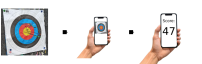
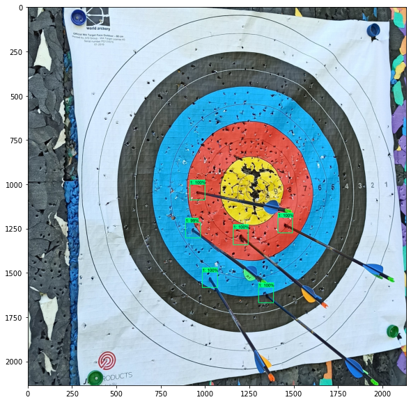
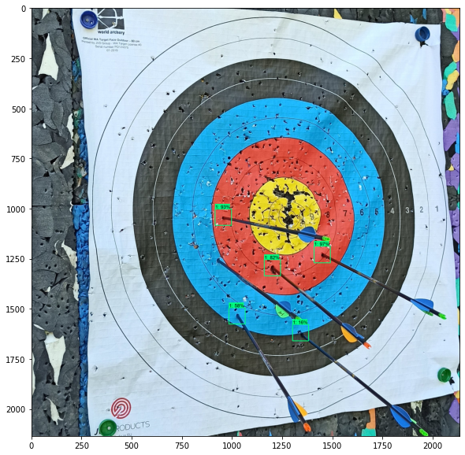

# Targets - AI driven archery scoring

## Idea - a picture is worth a thousand words

## How to do it

* Use object detection API in TensorFlow (v2.0+)
  * Train a model on given set annotated examples
  * Deploy the model either on mobile device (TensorFlow Lite) or online (as a service)
* Implement mobile (Android) application
  * Capture an image from camera
  * Process the image, send it to the model for detection and classification

## Preliminary results

### Detection using MobileNet SSD model with Tensorflow (2.6)
* running on PC.

### Detection using MobileNet SSD model with Tensorflow Lite (2.5)
* still running on PC.

### Detection using MobileNet SSD model with Tensorflow Lite (2.5)
* running on Android Phone.

TBD
